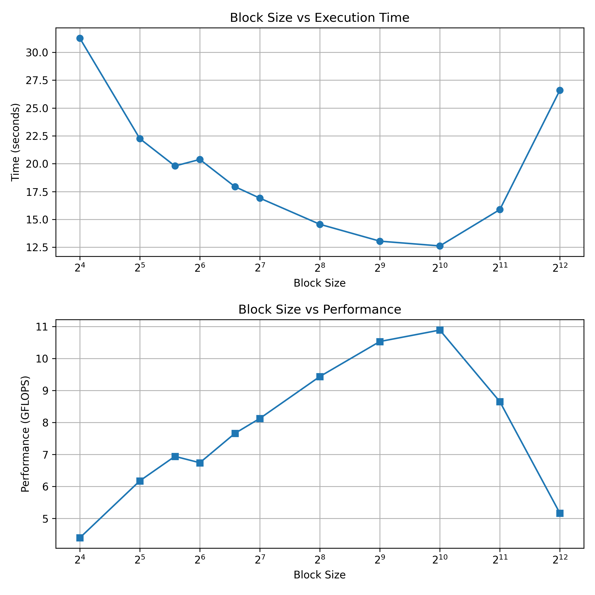

# cpu implementation of square matrix multiplication

N=4096
#### hardware
```
lscpu
Architecture:                         x86_64
CPU op-mode(s):                       32-bit, 64-bit
Byte Order:                           Little Endian
Address sizes:                        46 bits physical, 48 bits virtual
CPU(s):                               32
On-line CPU(s) list:                  0-31
Thread(s) per core:                   2
Core(s) per socket:                   8
Socket(s):                            2
NUMA node(s):                         2
Vendor ID:                            GenuineIntel
CPU family:                           6
Model:                                79
Model name:                           Intel(R) Xeon(R) CPU E5-2620 v4 @ 2.10GHz
Stepping:                             1
CPU MHz:                              2916.398
CPU max MHz:                          3000.0000
CPU min MHz:                          1200.0000
BogoMIPS:                             4200.15
Virtualization:                       VT-x
L1d cache:                            512 KiB
L1i cache:                            512 KiB
L2 cache:                             4 MiB
L3 cache:                             40 MiB
NUMA node0 CPU(s):                    0-7,16-23
NUMA node1 CPU(s):                    8-15,24-31
Vulnerability Gather data sampling:   Not affected
Vulnerability Itlb multihit:          KVM: Mitigation: VMX disabled
Vulnerability L1tf:                   Mitigation; PTE Inversion; VMX conditional cache flushes, SMT vulnerable
Vulnerability Mds:                    Mitigation; Clear CPU buffers; SMT vulnerable
Vulnerability Meltdown:               Mitigation; PTI
Vulnerability Mmio stale data:        Mitigation; Clear CPU buffers; SMT vulnerable
Vulnerability Reg file data sampling: Not affected
Vulnerability Retbleed:               Not affected
Vulnerability Spec rstack overflow:   Not affected
Vulnerability Spec store bypass:      Mitigation; Speculative Store Bypass disabled via prctl and seccomp
Vulnerability Spectre v1:             Mitigation; usercopy/swapgs barriers and __user pointer sanitization
Vulnerability Spectre v2:             Mitigation; Retpolines; IBPB conditional; IBRS_FW; STIBP conditional; RSB filling; PBRSB-eIBRS Not affected; BHI Not affected
Vulnerability Srbds:                  Not affected
Vulnerability Tsx async abort:        Mitigation; Clear CPU buffers; SMT vulnerable
Flags:                                fpu vme de pse tsc msr pae mce cx8 apic sep mtrr pge mca cmov pat pse36 clflush dts acpi mmx fxsr sse sse2 ss ht tm pbe syscall nx pdpe1gb rdtscp lm constant_tsc arch_perfmon pebs bts rep_
                                      good nopl xtopology nonstop_tsc cpuid aperfmperf pni pclmulqdq dtes64 monitor ds_cpl vmx smx est tm2 ssse3 sdbg fma cx16 xtpr pdcm pcid dca sse4_1 sse4_2 x2apic movbe popcnt tsc_deadline_t
                                      imer aes xsave avx f16c rdrand lahf_lm abm 3dnowprefetch cpuid_fault epb cat_l3 cdp_l3 invpcid_single pti intel_ppin ssbd ibrs ibpb stibp tpr_shadow vnmi flexpriority ept vpid ept_ad fsgsb
                                      ase tsc_adjust bmi1 hle avx2 smep bmi2 erms invpcid rtm cqm rdt_a rdseed adx smap intel_pt xsaveopt cqm_llc cqm_occup_llc cqm_mbm_total cqm_mbm_local dtherm ida arat pln pts md_clear flush
                                      _l1d
```
```
/home/cd_engine_group/group_common_dirs/cuda/cuda-10.1/extras/demo_suite/deviceQuery

Device 0: "NVIDIA GeForce GTX 1080 Ti"
  CUDA Driver Version / Runtime Version          11.4 / 10.1
  CUDA Capability Major/Minor version number:    6.1
  Total amount of global memory:                 11178 MBytes (11721244672 bytes)
  (28) Multiprocessors, (128) CUDA Cores/MP:     3584 CUDA Cores
  GPU Max Clock rate:                            1582 MHz (1.58 GHz)
  Memory Clock rate:                             5505 Mhz
  Memory Bus Width:                              352-bit
  L2 Cache Size:                                 2883584 bytes
  Maximum Texture Dimension Size (x,y,z)         1D=(131072), 2D=(131072, 65536), 3D=(16384, 16384, 16384)
  Maximum Layered 1D Texture Size, (num) layers  1D=(32768), 2048 layers
  Maximum Layered 2D Texture Size, (num) layers  2D=(32768, 32768), 2048 layers
  Total amount of constant memory:               65536 bytes
  Total amount of shared memory per block:       49152 bytes
  Total number of registers available per block: 65536
  Warp size:                                     32
  Maximum number of threads per multiprocessor:  2048
  Maximum number of threads per block:           1024
  Max dimension size of a thread block (x,y,z): (1024, 1024, 64)
  Max dimension size of a grid size    (x,y,z): (2147483647, 65535, 65535)
  Maximum memory pitch:                          2147483647 bytes
  Texture alignment:                             512 bytes
  Concurrent copy and kernel execution:          Yes with 2 copy engine(s)
  Run time limit on kernels:                     No
  Integrated GPU sharing Host Memory:            No
  Support host page-locked memory mapping:       Yes
  Alignment requirement for Surfaces:            Yes
  Device has ECC support:                        Disabled
  Device supports Unified Addressing (UVA):      Yes
  Device supports Compute Preemption:            Yes
  Supports Cooperative Kernel Launch:            Yes
  Supports MultiDevice Co-op Kernel Launch:      Yes
  Device PCI Domain ID / Bus ID / location ID:   0 / 8 / 0
  Compute Mode:
     < Default (multiple host threads can use ::cudaSetDevice() with device simultaneously) >
```

## naive
```cpp
 for (int i = 0; i < N; ++i)
    { // Row of A
        for (int j = 0; j < N; ++j)
        { // Column of B
            float sum = 0.0f;
            for (int k = 0; k < N; ++k)
            { // Dot product inner loop
                // Indexing: [row * N + col]
                sum += A[i * N + k] * B[k * N + j];
            }
            C[i * N + j] = sum;
        }
    }
```
### performance
- Time: 345.968 s
- Performance: 0.397259 GFLOPS

#### perf analysis
```
perf stat -e cycles,instructions,cache-misses,cache-references,branch-misses,branches,L1-dcache-loads,L1-dcache-load-misses,L1-icache-load-misses,LLC-loads,LLC-load-misses,dTLB-load-misses,iTLB-load-misses,cpu-migrations,context-switches matmul_cpu  
 1,807,552,079,054      cycles                                                        (30.77%)
   173,866,052,878      instructions              #    0.10  insn per cycle           (38.46%)
    46,532,999,942      cache-misses              #   64.711 % of all cache refs      (38.46%)
    71,908,905,700      cache-references                                              (38.46%)
        22,011,323      branch-misses             #    0.13% of all branches          (38.46%)
    17,573,556,532      branches                                                      (38.46%)
    86,456,184,001      L1-dcache-loads                                               (30.77%)
   103,834,549,165      L1-dcache-load-misses     #  120.10% of all L1-dcache accesses  (30.77%)
        35,708,073      L1-icache-load-misses                                         (30.77%)
    71,168,060,139      LLC-loads                                                     (30.77%)
    46,528,460,754      LLC-load-misses           #   65.38% of all LL-cache accesses  (30.77%)
    49,499,622,193      dTLB-load-misses                                              (30.77%)
         1,478,405      iTLB-load-misses                                              (30.77%)
               198      cpu-migrations                                              
            62,838      context-switches                                            

     606.797289586 seconds time elapsed

     606.075786000 seconds user
       0.351816000 seconds sys
```
program is severely memory-bound.

Evidence:

IPC = 0.10

cache miss rate ≈ 65%

very large LLC misses

extremely high TLB misses

The CPU is spending most cycles waiting for memory.

Typical root causes in code.

Random memory access patterns
(hash tables, graph traversal)

Pointer chasing
(linked lists, trees)

Working set larger than LLC

NUMA remote memory

Poor data layout

## loop transposition
```cpp
 for (int i = 0; i < N; ++i)
    { // Row of A
        for (int k = 0; k < N; ++k)
        { // Column of B
            float a_ik = A[i * N + k];
            for (int j = 0; j < N; ++j)
            { // Dot product inner loop
                // Indexing: [row * N + col]
                C[i * N + j] += a_ik * B[k * N + j];
            }
        }
    }
```
### performance
- Time: 24.0226 s
- Performance: 5.72123 GFLOPS

#### perf analysis
```
perf stat -e cycles,instructions,cache-misses,cache-references,branch-misses,branches,L1-dcache-loads,L1-dcache-load-misses,L1-icache-load-misses,LLC-loads,LLC-load-misses,dTLB-load-misses,iTLB-load-misses,cpu-migrations,context-switches matmul_cpu  
    75,864,434,732      cycles                                                        (30.75%)
    52,364,426,007      instructions              #    0.69  insn per cycle           (38.44%)
     2,560,011,692      cache-misses              #   41.173 % of all cache refs      (38.44%)
     6,217,626,938      cache-references                                              (38.46%)
        17,442,802      branch-misses             #    0.20% of all branches          (38.48%)
     8,749,728,948      branches                                                      (38.48%)
    17,400,096,021      L1-dcache-loads                                               (30.78%)
     4,442,529,834      L1-dcache-load-misses     #   25.53% of all L1-dcache accesses  (30.78%)
         7,054,816      L1-icache-load-misses                                         (30.77%)
     3,754,528,437      LLC-loads                                                     (30.77%)
     2,053,887,775      LLC-load-misses           #   54.70% of all LL-cache accesses  (30.78%)
        29,912,267      dTLB-load-misses                                              (30.76%)
           662,619      iTLB-load-misses                                              (30.75%)
                37      cpu-migrations                                              
             2,541      context-switches                                            

      25.887256513 seconds time elapsed

      25.543338000 seconds user
       0.307606000 seconds sys
```

program is now memory bandwidth / LLC latency limited, not catastrophic latency bound anymore.

Evidence:

IPC increased to 0.69

L1 miss rate moderate

LLC misses still significant

## cache blocking
```cpp for (int i = 0; i < N; i += blockSize)
    {
        for (int j = 0; j < N; j += blockSize) 
        {
            for (int k = 0; k < N; k += blockSize)
            {
                // Compute min to handle edge cases when N is not divisible by blockSize
                int i_max = std::min(i + blockSize, N);
                int j_max = std::min(j + blockSize, N);
                int k_max = std::min(k + blockSize, N);

                // Blocked multiplication
                for (int ii = i; ii < i_max; ++ii)
                {
                    for (int kk = k; kk < k_max; ++kk)
                    {
                        float a_ik = A[ii * N + kk];
                        for (int jj = j; jj < j_max; ++jj)
                        {
                            C[ii * N + jj] += a_ik * B[kk * N + jj];
                        }
                    }
                }
            }
        }
    }
```
### performance


BS=1024
- Time: 13.0037 s
- Performance: 10.5692 GFLOPS
#### perf analysis
```
perf stat -e cycles,instructions,cache-misses,cache-references,branch-misses,branches,L1-dcache-loads,L1-dcache-load-misses,L1-icache-load-misses,LLC-loads,LLC-load-misses,dTLB-load-misses,iTLB-load-misses,cpu-migrations,context-switches matmul_cpu
    38,355,155,592      cycles                                                        (30.77%)
    53,401,284,202      instructions              #    1.39  insn per cycle           (38.49%)
        14,155,988      cache-misses              #    0.289 % of all cache refs      (38.51%)
     4,897,369,382      cache-references                                              (38.51%)
        67,377,160      branch-misses             #    0.76% of all branches          (38.51%)
     8,908,096,085      branches                                                      (38.48%)
    17,801,073,082      L1-dcache-loads                                               (30.75%)
     4,403,687,328      L1-dcache-load-misses     #   24.74% of all L1-dcache accesses  (30.75%)
         1,081,417      L1-icache-load-misses                                         (30.75%)
       810,839,557      LLC-loads                                                     (30.75%)
         5,994,206      LLC-load-misses           #    0.74% of all LL-cache accesses  (30.75%)
        75,438,702      dTLB-load-misses                                              (30.75%)
           336,525      iTLB-load-misses                                              (30.75%)
                 2      cpu-migrations                                              
             1,631      context-switches  

```

## avx2 + unroll4
```cpp
 for (int ii = 0; ii < N; ii += BS)
        for (int kk = 0; kk < N; kk += BS)
            for (int jj = 0; jj < N; jj += BS)
            {
                int i_end = std::min(ii + BS, N);
                int k_end = std::min(kk + BS, N);
                int j_end = std::min(jj + BS, N);

                for (int i = ii; i < i_end; ++i)
                    for (int k = kk; k < k_end; ++k)
                    {
                        const float *Aik = &A[i * N + k];  // scalar, hoisted
                        const float *Bkj = &B[k * N + jj]; // row pointer
                        float *Cij = &C[i * N + jj];       // row pointer

                        __m256 temp = _mm256_set1_ps(*Aik);

                        int j = 0;
                        int width = j_end - jj;

                        // 4x unrolled: 32 floats per iteration
                        for (; j <= width - 32; j += 32)
                        {
                            __m256 c0 = _mm256_loadu_ps(Cij + j);
                            __m256 c1 = _mm256_loadu_ps(Cij + j + 8);
                            __m256 c2 = _mm256_loadu_ps(Cij + j + 16);
                            __m256 c3 = _mm256_loadu_ps(Cij + j + 24);

                            __m256 b0 = _mm256_loadu_ps(Bkj + j);
                            __m256 b1 = _mm256_loadu_ps(Bkj + j + 8);
                            __m256 b2 = _mm256_loadu_ps(Bkj + j + 16);
                            __m256 b3 = _mm256_loadu_ps(Bkj + j + 24);

                            c0 = _mm256_fmadd_ps(temp, b0, c0);
                            c1 = _mm256_fmadd_ps(temp, b1, c1);
                            c2 = _mm256_fmadd_ps(temp, b2, c2);
                            c3 = _mm256_fmadd_ps(temp, b3, c3);

                            _mm256_storeu_ps(Cij + j, c0);
                            _mm256_storeu_ps(Cij + j + 8, c1);
                            _mm256_storeu_ps(Cij + j + 16, c2);
                            _mm256_storeu_ps(Cij + j + 24, c3);
                        }

                        // 1x: remaining 8-float chunks
                        for (; j <= width - 8; j += 8)
                        {
                            __m256 c = _mm256_loadu_ps(Cij + j);
                            __m256 b = _mm256_loadu_ps(Bkj + j);
                            _mm256_storeu_ps(Cij + j, _mm256_fmadd_ps(temp, b, c));
                        }

                        // scalar tail
                        for (; j < width; ++j)
                            Cij[j] += (*Aik) * Bkj[j];
                    }
            }
```
### performance
BS=1024
- Time: 11.9795 s
- Performance: 11.4728 GFLOPS
#### perf analysis
```
perf stat -e cycles,instructions,cache-misses,cache-references,branch-misses,branches,L1-dcache-loads,L1-dcache-load-misses,L1-icache-load-misses,LLC-loads,LLC-load-misses,dTLB-load-misses,iTLB-load-misses,cpu-migrations,context-switches matmul_cpu
    35,788,902,048      cycles                                                        (30.71%)
    30,703,147,695      instructions              #    0.86  insn per cycle           (38.42%)
       148,473,285      cache-misses              #    2.991 % of all cache refs      (38.47%)
     4,963,910,090      cache-references                                              (38.50%)
           296,820      branch-misses             #    0.03% of all branches          (38.53%)
       918,135,356      branches                                                      (38.54%)
    18,618,170,452      L1-dcache-loads                                               (30.83%)
     4,408,021,810      L1-dcache-load-misses     #   23.68% of all L1-dcache accesses  (30.83%)
           988,770      L1-icache-load-misses                                         (30.78%)
     1,036,836,992      LLC-loads                                                     (30.75%)
        94,576,567      LLC-load-misses           #    9.12% of all LL-cache accesses  (30.70%)
        73,450,836      dTLB-load-misses                                              (30.67%)
           316,022      iTLB-load-misses                                              (30.69%)
                 4      cpu-migrations                                              
             1,254      context-switches                                            

      12.147009785 seconds time elapsed

      12.005820000 seconds user
       0.131932000 seconds sys

```
## microkernel design
### Why This Is Fundamentally Different
```
Your blocked kernel:           True microkernel (this):
─────────────────────────────────────────────────────
C loaded every k iter    →     C lives in registers entire K loop
B accessed with stride N →     B packed stride-1, fits L3
A broadcast each k       →     A packed stride-1, fits L2
16 ymm regs underused    →     ALL 16 ymm regs used for C tile
IPC ~1.1                 →     target IPC ~2.5+

Memory ops per FMA:
  before:  load_B + load_C + store_C = 3
  after:   load_B only = 1  (C stays in registers!)
           A is broadcast from L1 (1 scalar load → 8 lanes free)
```

---

### Register Tile Diagram
```
         NR=16 cols
         ymm0    ymm1
    ┌────────┬────────┐
  0 │ c00    │ c01    │
  1 │ c10    │ c11    │
MR  │  ...   │  ...   │  ← all 16 ymm registers
=8  │  ...   │  ...   │     holding C tile
  7 │ c70    │ c71    │
    └────────┴────────┘
         ↑
    never touches memory
    during K loop
```

---

### Expected Performance
```
Your best so far:       ~13 GFLOPS   (10.5s)
This microkernel:       ~14–16 GFLOPS (single core ceiling)
Theoretical AVX2 peak:  16.8 GFLOPS

The gap to OpenBLAS is now just loop overhead + tuning,
not structural — you're using the same algorithm.